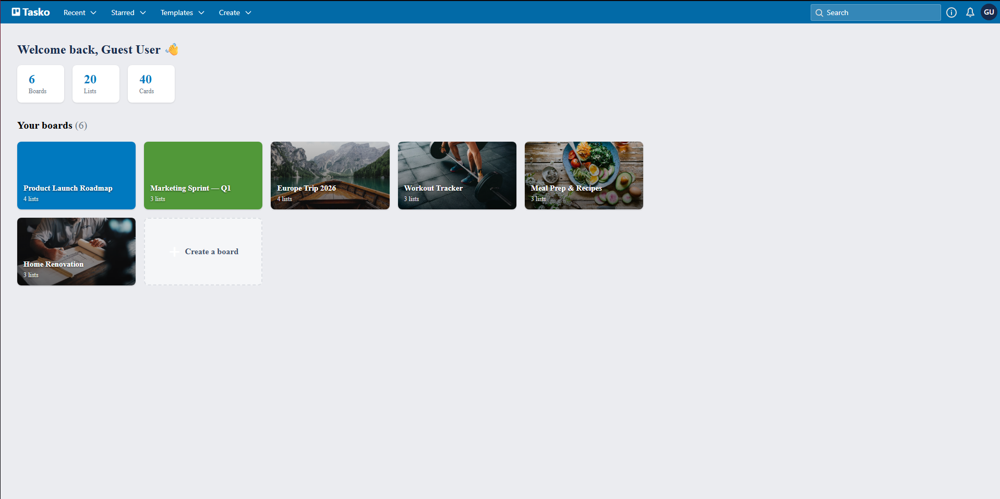

# Tasko

A full-stack Trello clone — boards, lists, cards, drag-and-drop, real-time sync over WebSockets, and session-based auth with a one-click guest mode for demos.

[](https://tasko-front-end.vercel.app)
[](./LICENSE)


**[→ tasko-front-end.vercel.app](https://tasko-front-end.vercel.app)** — click **"Let's start"** to explore instantly as a guest, no signup needed. Comes pre-loaded with several sample boards (travel planning, a workout tracker, a product roadmap, etc.) so there's real content to look at immediately.

<!--
Add 2-3 screenshots here, e.g.:


-->

## Features

- Create boards, lists, and cards with full drag-and-drop reordering
- Labels, checklists, due dates, card descriptions, and photo covers
- A dashboard showing all your boards with live stats (board/list/card counts)
- Real-time board updates across sessions via Socket.IO
- Session-based auth (signup/login) plus a one-click guest mode
- Responsive Vue 3 + Vite frontend, Express/MongoDB backend

## Tech stack

**Frontend:** Vue 3, Vuex, Vue Router, Vite, SCSS, vue3-smooth-dnd, Socket.IO client
**Backend:** [Tasko backend →](https://github.com/EL00SE/Tasko-back-End) — Node/Express, MongoDB + Mongoose, Socket.IO, express-session
**Deployment:** Frontend on Vercel, backend on Render, database on MongoDB Atlas

## Architecture

```
Vue 3 SPA (Vercel)  ──HTTP/JSON──>  Express API (Render)  ──>  MongoDB Atlas
                     <─WebSocket─>  Socket.IO server
```

Boards, lists ("groups"), and cards are stored as nested documents on a single `board` collection; the API is a thin REST layer over it (`/api/board`, `/api/user`, `/api/auth`), and Socket.IO broadcasts board changes to everyone else viewing the same board in real time.

## Local development

```sh
npm install
npm run dev        # starts Vite dev server against localhost:3030
```

By default it talks to the backend at `http://localhost:3030` — see [Tasko-back-End](https://github.com/EL00SE/Tasko-back-End) to run that locally too, or point `src/services/http.service.js` / `socket.service.js` at the deployed Render backend instead.

```sh
npm run build       # production build to dist/
npm run test:unit   # Vitest
```

## Roadmap

- Code-split the main bundle (currently a single ~1.5MB chunk)
- A "recently viewed" / "starred boards" section on the dashboard, backed by real view-tracking

## License

[MIT](./LICENSE)
